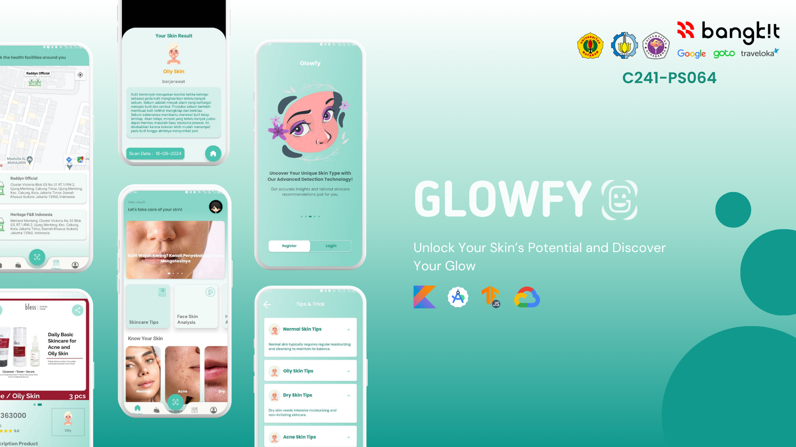

# Glowfy - Unlock Your Skin’s Potential and Discover Your Glow
(C241-PS064)

Welcome to Glowfy, a comprehensive skin health application designed to help you take better care of your skin. This application provides a variety of features to keep you informed and assist you in your skincare routine.

## Contributors

1. (MD) A009D4KY4471 - Muhammad Farhan Fathurrohman
2. (MD) A253D4KY4134 - Lalu Zhafran Farras Rahman
3. (CC) C009D4KY0268 - Muhammad Abdullaah Izzuddiin
4. (CC) C253D4KY0918 - Hilman Zulqarami
5. (ML) M004D4KX1512 - Anisa Ghina Salsabila
6. (ML) M253D4KX1925 - Nurul Anzila Wahyana
7. (ML) M004D4KX3373 - Dyas Amorita Radhwa Nashirah

## Other Repositories

#### ML - [Machine Learning Github Repository](https://github.com/dMorran/ML_Capstone/tree/main)

#### CC - [Cloud Computing Github Repository](https://github.com/EMNYZER/Glowfy)

## Our LinkedIn
| Nama       | LinkedIn     |
|---------------|-------------|
| Muhammad Farhan Fathurrohman| [](https://www.linkedin.com/in/farhan-fathur/)|
| Lalu Zhafran Farras Rahman|[](https://www.linkedin.com/in/laluzhafran/)|
| Muhammad Abdullaah Izzuddiin|[](https://www.linkedin.com/in/muhammad-abdullaah-izzuddiin/)|
| Hilman Zulqarami|[](https://www.linkedin.com/in/hilman-zulqarami/)|
| Anisa Ghina Salsabila|[](https://www.linkedin.com/in/anisa-ghina-salsabila-652723220/)|
| Nurul Anzila Wahyana|[](https://www.linkedin.com/in/nurul-anzila-wahyana/)|
| Dyas Amorita Radhwa Nashirah|[](https://www.linkedin.com/in/dyas-amorita-radhwa-nashirah-1044a2222/)|

## Features

- **Authentication**
  - **Register**: Create a new account.
  - **Login**: Access your existing account.

- **Face Scan**
  - Use the face scan feature to detect and analyze your skin condition.

- **Nearby Clinic Locator**
  - Find skincare clinics near your location.

- **Recommended Skincare Products**
  - Get a curated list of skincare products tailored to different skin types.

- **Articles List**
  - Browse a wide range of articles about skin health and skincare tips.


- **Skin Types List**
  - Learn about different skin types and identify your own.

- **Profile Customization**
  - Customize your profile with personal information.

## Installation Instructions

To get started with the Glowfy project, follow these steps:

1. **Clone the repository**
   ```bash
   git clone https://github.com/your-username/glowfy.git
   cd glowfy
   ```
2. **Add Google Maps API Key**
    - Open the local.properties file in the project root directory.
    - Add your Google Maps API key :
    ```properties
    MAPS_API_KEY=your_google_maps_api_key
    ```
3. **Build and Run the Project**
    - Open the project in Android Studio.
    - Build the project.
    - Run the project on an emulator or a physical device.

## Additional Notes
- Ensure you have the latest version of Android Studio installed.
- Make sure your environment is set up for Android development (e.g., Android SDK, JDK).

If you encounter any issues or have any questions, please refer to the project's documentation or open an issue on GitHub.